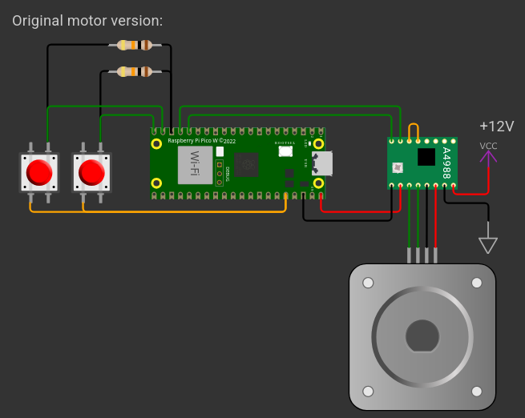
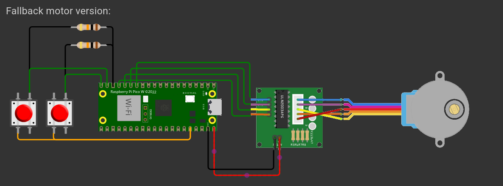

# Solo Innovator Y1 P3
- Name: Peter Kapsiar
- Student ID: 5486866
- Repository: https://github.com/pop9459/P3-Portfolio

### Description
The project is focused on creating an automated system for opening and closing window courtains. The system uses a raspberry pi pico w microcontroller to control a stepper motor to pull strings attached to the curtains. The system can be controlled via physical buttons or remotely via API endpoints. The whole system is powered by a solar panel and a power bank. 

Components used:
- Raspberry Pi Pico W
- Neema 17 stepper motor
- A4988 stepper motor driver
- 2x buttons
- 2x 10k ohm resistors

During the project there was some accidental damage to the stepper motor driver which is why in the demo video I replaced the motor and the driver with a smaller stepper motor and a different driver. 

The project is inspired by a similar project from the youtube channel: "DIY Machines" (https://www.youtube.com/@DIYMachines) with the video "DIY - Alexa Curtain Control System - (3D Printable, Echo, Adafruit Feather Huzzah ESP8266)" (https://www.youtube.com/@DIYMachines)

### Schematic




### Code
`main.py`
```python
```

### Output

overview video: https://youtu.be/afZEDE46g-k?si=IUZLnpNUe_IK7F3g